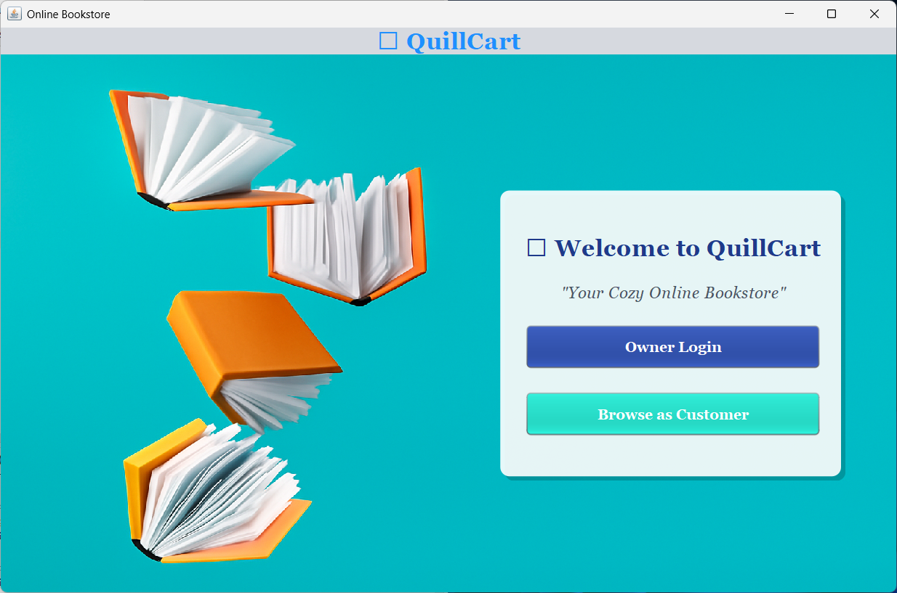
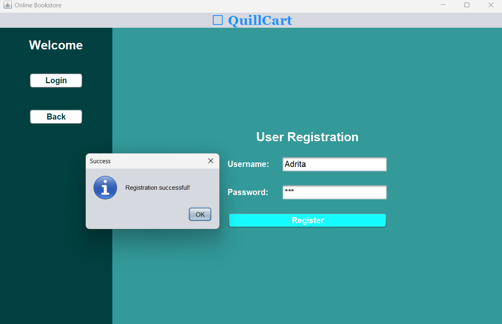
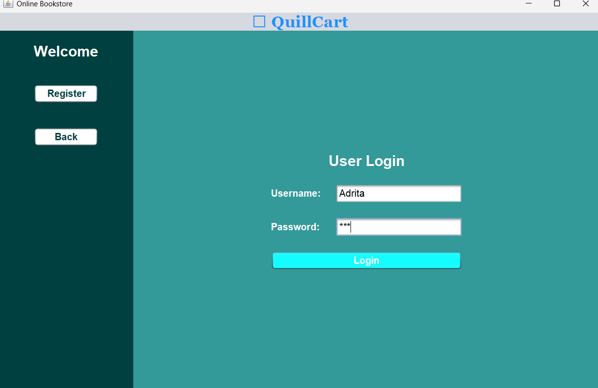
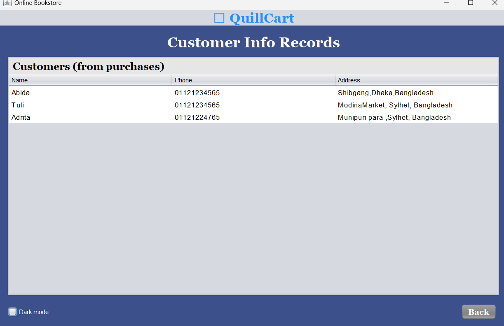
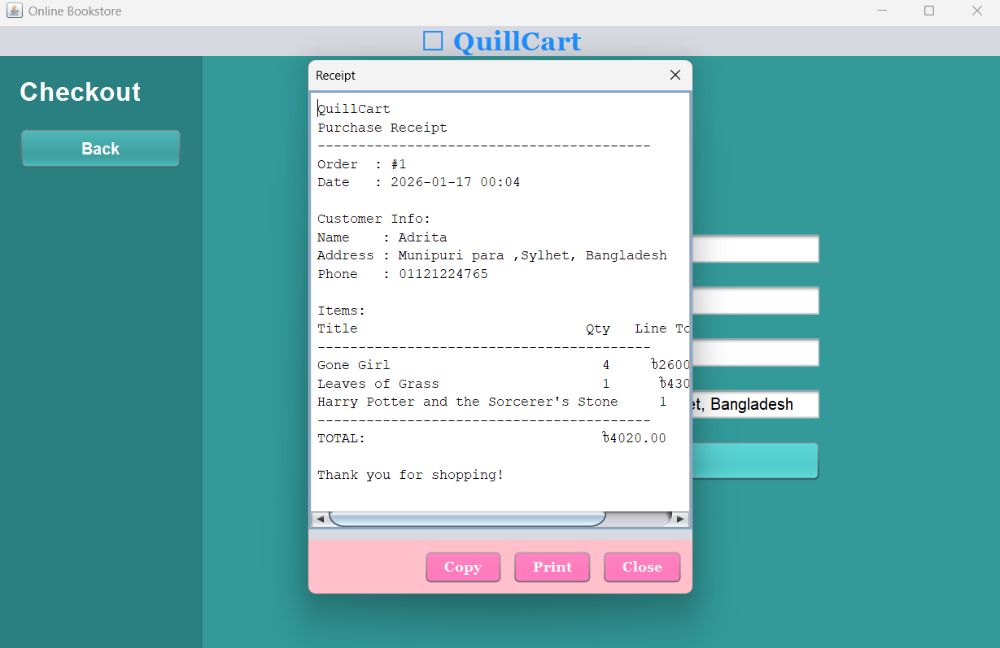

# Quillcart Maven Project

This project contains a simple online bookstore GUI application developed using Java Swing. The project has been structured as a Maven project so that it can be easily imported into popular IDEs like IntelliJ IDEA, Eclipse, or NetBeans.

## Structure

```
quillcartraya_maven_project/
├── pom.xml
├── README.md
└── src
    └── main
        └── java
            └── com
                └── mycompany
                    └── quillcartraya
                        ├── Book.java
                        ├── CustomerPanel.java
                        ├── ExampleUI.java
                        ├── ImprovedQuillcartRaya.java
                        ├── MainWindow.java
                        ├── OwnerLoginPanel.java
                        ├── OwnerPanel.java
                        ├── Purchase.java
                        ├── PurchaseHistoryPanel.java
                        ├── ReceiptDialog.java
                        ├── UIX.java
                        └── WelcomePanel.java
```
## Application Interface


### 1. Welcome & Authentication
| Welcome Page | Customer Registration | Customer Login | Owner Login |
| :---: | :---: | :---: | :---: |
|  |  |  |  |

### 2. Shopping Experience
| Main Store | Checkout Page | Purchase Confirmation |
| :---: | :---: | :---: |
|  |  |  |

### 3. Management & History
| Customer Records | Order Details | Owner Dashboard |
| :---: | :---: | :---: |
|  |  |  |

### 4. Receipts
| Digital Receipt | Print Preview |
| :---: | :---: |
|  |  |

---


## How to Build and Run

1. **Import the project** into your preferred IDE as a Maven project. Most IDEs will detect the `pom.xml` file and set up the project automatically.

2. **Build the project** using Maven. From the command line, you can run:
   ```sh
   mvn clean package
   ```
   This will compile the project and generate a JAR file under the `target` directory. The JAR will have the `Main-Class` set to `com.mycompany.quillcartraya.MainWindow` so you can run it directly.

3. **Run the application** by executing the JAR file:
   ```sh
   java -jar target/quillcartraya-1.0-SNAPSHOT.jar
   ```
   Alternatively, you can run the application directly from your IDE.

## Notes

- The project uses only Java's standard library, so no external dependencies are required.
- The default owner password is `owner123`.
- There's a promotional code **`MetroElite`** that gives a discount to the customer at checkout.

Enjoy exploring the online bookstore!

---

## 🎓 Developer Profile

| Detail | Information |
| :--- | :--- |
| **Name** | Adrita Chakraborty |
| **Student ID** | [232-115-324] |
| **Institution** | [Metropolitan University] |
| **Department** | Computer Science and Engineering |

*Developed as part of the Academic Curriculum 2026*
